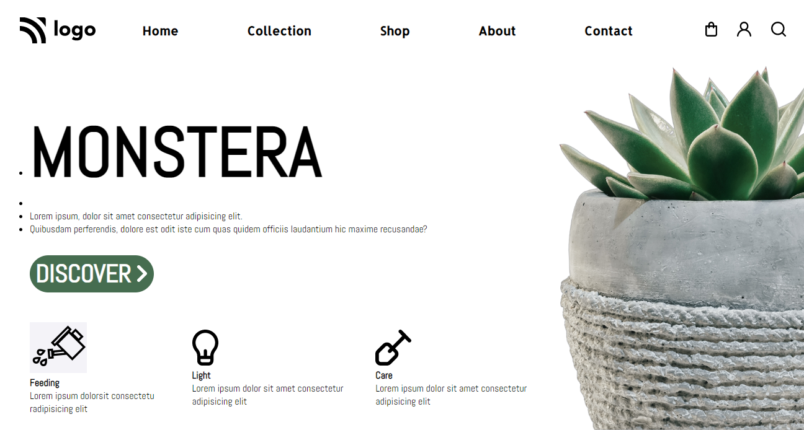
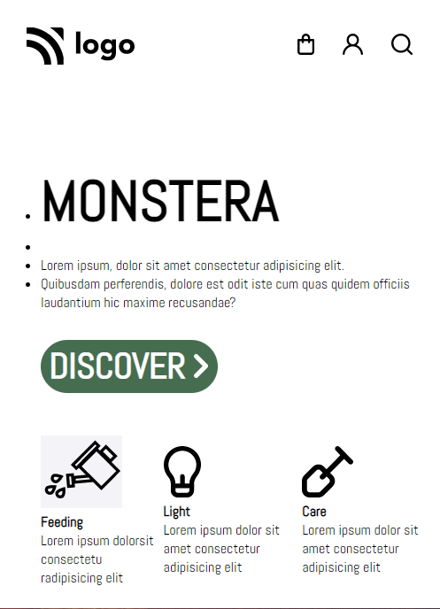

## [DeployedLink]()
# Plant Homepage - HTML  and CSS 
By Shiwansh
## Complete Project

## Responsive Design - Small Screen

## What I learned from this project?
- How to use id-selectors.
- Selector specificity and its implications.

# It took me 1:30 hours to complete this project
